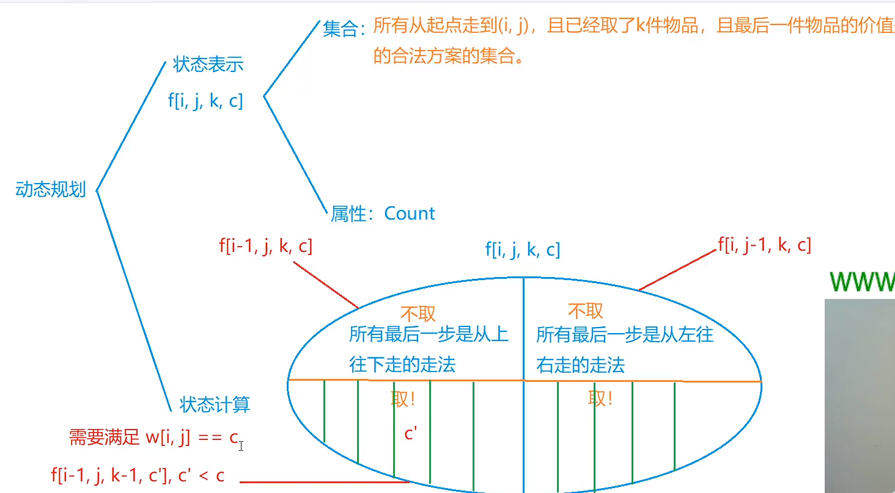

- 对于互质的两个数p，q，px+py 不能表示的最大数为pq-p-q.
[详细证明](https://www.cnblogs.com/Yuzao/p/7074465.html "证明")

****

- 蚂蚁感冒，很像C语言做的那个题
> 关键的思路是，将蚂蚁相撞的过程变成穿过的过程，这两个过程是一样的，可以看做是灵魂交换:)
> 由此来分析问题就会变得简单很多
```cpp
#include <iostream>
#include <cmath>
using namespace std;

const int N = 55;
int pos[N];
int main(){
    int n;
    cin >> n;
    for(int i = 1; i <= n; i++)
        cin >> pos[i];
    int cnt = 1;
    int p = abs(pos[1]);
    
    bool flag = 0;
    if(pos[1] < 0){
        for(int i = 2; i <= n; i++){
            if(abs(pos[i]) < p && pos[i] > 0){
                flag = 1;
                break;
            }
        }
    }else{
        for(int i = 2; i <= n; i++){
            if(abs(pos[i]) > p && pos[i] < 0){
                flag = 1;
                break;
            }
        }
    }
    
    if(!flag){
        cout << 1 << endl;
        return 0;
    }
    
    if(pos[1] > 0){
        for(int i = 2; i <= n; i++){
            if((abs(pos[i]) < p && pos[i] > 0) || (abs(pos[i]) > p && pos[i] < 0))
                cnt ++;
        }
    }else {
        for(int i = 2; i <= n; i++){
            if((abs(pos[i]) < p && pos[i] > 0) || (abs(pos[i]) > p && pos[i] < 0))
                cnt ++;
        }
    }
    
    cout << cnt << endl;
    return 0;
}
```
> 这个版本的，对条件的划分不太明确，导致了代码的冗长
```cpp
#include <iostream>
#include <cstdio>
#include <cmath>
using namespace std;
int n; 
int main()
{
    scanf("%d", &n);
    int pivot, left = 0, right = 0;
    scanf("%d", &pivot);

    for (int i = 1; i < n; i++)
    {
        int x;
        scanf("%d", &x);
        //找到感冒蚂蚁左边边且向右走的
        if (abs(x) < abs(pivot) && x > 0) right++;
        //找到感冒蚂蚁右边且向左走的
        if (abs(x) > abs(pivot) && x < 0) left++;
    }
    //特殊情况
    if ((pivot < 0 && right == 0) || pivot > 0 && left == 0) puts("1");
    else printf("%d\n", left + right + 1);

    return 0;
}

```
****
- 饮料换购
```cpp
// 递归形式
#include <iostream>

using namespace std;

int n, m;
int cnt = 0;

void get(int n, int m){
    if(n == 0 && m < 3 ) return ;
    cnt += n;
    m += n;
    n = 0;
    
    int t = m / 3;
    n += t;
    m = m % 3;
    get(n, m);
}

int main(){
    cin >> n;a
    get(n, m);
    cout << cnt << endl;
    
    return 0;
}

//非递归
#include <iostream>

using namespace std;

int n;


int main(){
    cin >> n;
    int m = 0;
    int cnt = 0;
    
    while(n > 0){
        m += n;
        cnt += n;
        n = m / 3;
        m = m % 3; 
    }
    
    cout << cnt << endl;
}
```
****
- 01背包
```cpp
#include <iostream>
#include <algorithm>

using namespace  std;

const int N = 1005;
int v[N], w[N];
int dp[N];
int d[N][N];

int n, V;

int main(){
    cin >> n >> V;
    
    for(int i = 1; i <= n; i++)
        cin >> v[i] >> w[i];
        
    for(int i = 1; i <= n; i++)
        for(int j = V; j >= v[i]; j--)
            dp[j] = max(dp[j], dp[j - v[i]] + w[i]);
            
    for(int i = 1; i <= n; i ++)
        for(int j = 0; j <= V; j++ ){
            if(j >= v[i]){
                d[i][j] = max(d[i - 1][j], d[i - 1][j - v[i]] + w[i]);
            }
            ///+++++++++这里很重要，是另一种状态的转移
            else d[i][j] = d[i - 1][j];
        }
    
    cout << dp[V] << endl;
    
    for(int i = 0; i <= n; i++){
        for(int j = 0; j <= V; j++){
            cout << d[i][j] << " ";
        }
        cout << endl;
    }
    return 0;
}
```

***


```cpp
#include <iostream>

using namespace std;

const int N = 55, M = 15;
const int MOD = 1000000007;

int g[N][N];
bool visit[N][N][M][M];
int cache[N][N][M][M];
int n, m, k;

// 访问并记录
void visit_and_record(int r, int c, int num, int last, int res) {
    visit[r][c][num][last] = true;
    cache[r][c][num][last] = res;
}

int dfs(int r, int c, int num, int last) {
    if(r > n || c > m) {
        visit_and_record(r, c, num, last, 0);
        return 0; // 不能越界
    }

    if(r == n && c == m) { // 到了终点
        if(num == k || (num == k - 1 && g[r][c] > last)) {
            visit_and_record(r, c, num, last, 1);
            return 1; 
        } else {
            visit_and_record(r, c, num, last, 0);
            return 0; 
        }
    }

    int res = 0;
    // 向下 不拿 
    if(visit[r + 1][c][num][last]) res = (res + cache[r + 1][c][num][last]) % MOD;
    else res = (res + dfs(r + 1, c, num, last)) % MOD;

    // 向右 不拿
    if(visit[r][c + 1][num][last]) res = (res + cache[r][c + 1][num][last]) % MOD;
    else res = (res + dfs(r, c + 1, num, last)) % MOD;

    /** 可以拿 **/
    if(g[r][c] > last) { 
        // 向下 拿
        if(visit[r + 1][c][num + 1][g[r][c]]) res = (res + cache[r + 1][c][num + 1][g[r][c]]) % MOD;
        else res = (res + dfs(r + 1, c, num + 1, g[r][c])) % MOD;

        // 向右 拿
        if(visit[r][c + 1][num + 1][g[r][c]]) res = (res + cache[r][c + 1][num + 1][g[r][c]]) % MOD;
        else res = (res + dfs(r, c + 1, num + 1, g[r][c])) % MOD;
    }
    visit_and_record(r, c, num, last, res);
    return res;
}

int main() {
    scanf("%d%d%d", &n, &m, &k);

    for(int i = 1; i <= n; i ++) {
        for(int j = 1; j <= m; j ++) {
            scanf("%d", &g[i][j]);
            g[i][j] ++;
        }
    }

    cout << dfs(1, 1, 0, 0) << endl;

    return 0;
}
```


```cpp
#include <iostream>

using namespace std;

const int N = 55;
int n, m, k;
int dp[N][N][13][14], v[N][N];
const int MOD = 1e9 + 7;
//波动数列
void solve(){
    const int N = 1010;
    int MOD = 100000007;
    int n, s, a, b;
    int dp[N][N];

    cin >> n >> s >> a >> b;
    dp[0][0] = 1;

    for(int i = 1; i <= n; i++)
        for(int j = 0; j < n; j++)
        //这里需要编写一个函数用于求解正余数
        dp[i][j] = (dp[i - 1][(j - (i - 1) * a) % n] + dp[i -1][(j + (n - i) * b) % n]) % MOD;
    
    cout << dp[n - 1][s % n] << endl;
}
int main(){
    //地宫寻宝
    cin >> n >> m >> k;
    for(int i = 1; i <= n; i++)
        for(int j = 1; j <= m; j++){
            cin >> v[i][j];
            v[i][j] ++;
        }
    
    dp[1][1][0][0] = 1;
    dp[1][1][1][v[1][1]] = 1;

    for(int i = 1; i <= n; i++)
        for(int j = 1; j <= m; j++){
            if(i == 1 && j == 1) continue;
            for(int x = 0; x <= k; x++)
                for(int y = 0; y <= 13; y++)
                {   
                    int& val = dp[i][j][x][y];
                    val = (val + dp[i-1][j][x][y]) % MOD;
                    val = (val + dp[i][j-1][x][y]) % MOD;

                    if(v[i][j] == y && x > 0){
                        for(int mm = 0; mm < y; i++){
                            //p3 += dp[i - 1][j][x - 1][mm];
                            //p4 += dp[i][j - 1][x - 1][mm];
                            val = (val + dp[i-1][j][x-1][mm]) % MOD;
                            val = (val + dp[i][j-1][x-1][mm]) % MOD;
                        }
                    }
                }
        }
    int res = 0;

    for(int i = 0; i <= 13; i++)
        res += dp[n][m][k][i];
    return 0;
}
```